# 数据结构(Java)

## 基础数据结构入门

- 数据结构分类：
    - 数组（Array）
    - 栈（Stack）
    - 链表（Linked List）
    - 图（Graph）
    - 散列表（Hash）
    - 队列（Queue）
    - 树（Tree）
    - 堆（Heap）

- **常考：**`Array, String, LinkedList, Tree(BT, BST), Stack, Queue, PriorityQueue(Heap), HashMap, HashSet`
- 少考：`Trie, Disjoint-Set(Union Find), Deque, Graph`
- 一般不考，但是用来一题多解更快：`TreeMap, TreeSet, Segment Tree(zkw Tree), Binary Index Tree(Fenwick Tree)`

- Java中的集合体系结构
    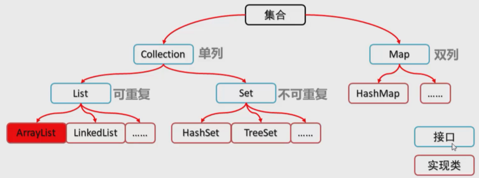

---

### Array数组
> 适用场景：频繁查询，对存储空间要求不大，很少增加和删除的情况。

- 基本操作：
    ```
    //打印数组
    int[]nums = new int[10];
    System.out.println(Arrays.toString(nums));
    ```
---

### String字符串——non primitive data type
- primitive type指的是：boolean, int, char, double, long, byte, short, float
- non-primitive type指的是：String, Arrays, Classes, Interfaces

- 常用method:
    ```
    str.substring();
    str.charAt(index);
    str1.compareTo(str2);
    ```
---

### Linked List链表

- 常用method，赋值取值时间复杂度均为 O(1)
    ```
    ListNode head = new ListNode(0); // 初始化
    head.next = new ListNode(1); // 赋值
    head.val; // 取值
    ```
适用场景：数据量比较小，需要频繁增加、删除操作的场景

---

### Tree树

- Binary Tree: 
    ```
    class TreeNode{
        TreeNode left;
        TreeNode right;
        public TreeNode(int val){
            this.val = val;
        }
    }
    ```
---

### Trie 前缀树或字典树 
字典树的性质：
1. 根节点（Root）不包含字符，除根节点外的每一个节点都仅包含一个字符
2. 从根节点到某一节点路径上所经过的字符连接起来，即为该节点所对应的字符串
3. 任意节点的所有子节点所包含的字符都不相同

- 基础method:
    ```
    addWord()
    searchWord()
    searchPrefix()
    // 时间复杂度均为 word.length
    ```

- 应用：
  - 自动补全
  - 拼写检查
  - IP路由
  - 九键打字预测
  - 词频统计

---

### Stack栈 Last In First Out(LIFO) or First In Last Out(FILO)
> 甲骨文官方doc推荐使用 `Deque` 来代替Stack，因为内部实现更合理，**Vector vs Queue interface**。`Deque<Integer> stack = new ArrayDeque<Integer>();`
> 
> `Stack<Integer> stack = new Stack<>();` 也可

- 常用method，时间复杂度均为O(1)
    ```
    stack.push(num)
    stack.peek()
    stack.pop()
    stack.isEmpty()
    ```
- DFS

---

### Queue队列 First In First Out(FIFO)
> `Queue<Integer> queue = new LinkedList<>();`

- 常用方法，时间复杂度均为O(1)。相比 `add` 和 `remove` 方法，更推荐 `offer` 和 `poll` 方法进行添加和删除的操作（可以处理空的操作）。
    ```
    queue.offer(1);
    queue.offer(2);
    queue.poll();
    queue.poll();
    ```
- BFS

---

### Deque双端队列（Double-ended queue）
> `Deque<Integer> deque = new ArrayDeque<>();`
> 
> `Deque<Integer> deque = new LinkedList<>();`

- 常用方法，时间复杂度均为O(1)
    ```
    deque.offerLast(1); // 1
    deque.addLast(2); // 1->2
    deque.offerFirst(0); // 0->1->2
    deque.peekFirst(); // return 0
    deque.pollFirst(); // return 0, 剩下1->2
    deque.pollLast(); // return 2
    ```

---

### PriorityQueue(Heap) 堆(最大堆，最小堆)
> 最大堆和最小堆的差别在于节点的排序方式。最大堆中，父节点的值比每一个子节点的值都要大。最小堆中，父节点的值比每一个子节点的值都要小。Java中`PriorityQueue`默认最小堆

> 初始化 `PriorityQueue<Integer> pq = new PriorityQueue<>();`

- 常用方法
    ```
    pq.offer(2); // 时间复杂度O(logn)
    pq.add(0); // 时间复杂度O(logn) 
    pq.add(1);
    pq.peek(); // return 0, 时间复杂度O(1)
    pq.poll(); // return 0, 时间复杂度O(logn)
    pq.poll(); // return 1, 时间复杂度O(logn)
    ```

    ```
    /*
    自定义排序规则的优先队列
    (1) 按单词出现频率从大到小排列
    (2) 出现频率相同的单词按字典序排列

    输出优先队列的前K个 即为答案
        */
    PriorityQueue<Map.Entry<String, Integer>> queue = new PriorityQueue<>(new Comparator<Map.Entry<String, Integer>>() {
        @Override
        public int compare(Map.Entry<String, Integer> o1, Map.Entry<String, Integer> o2) {
            if (Objects.equals(o1.getValue(), o2.getValue())){ // 出现次数相同时
                return o1.getKey().compareTo(o2.getKey()); // 字典序
            }
            return o2.getValue() - o1.getValue();
        }
    });
    ```
- pq的应用和array手动实现heap

---

### Map散列表, 哈希表
> key和value之间的映射
> 
> 初始化 `Map<String, Integer> map = new HashMap<>();`

- 常用方法，添加和查找时间复杂度为O(1)
    ```
    map.put("A", 0);
    map.put("B", 1);
    map.put("C", 2);
    map.get("A"); //return 0
    map.get("C"); // return 2
    map.containsKey("B"); // return true
    map.toString(); // {A=0, B=1, C=2}
    ```
- 2个不同的key对应的index出现冲突的时候
  - 挂链法 seperate Chaining
  - 开放地址法 open addressing

- 查找比纯链表快，插入删除比纯数组快

---

### Set
> HashSet底层使用HashMap来保存所有元素
> 
> 初始化 `Set<Integer> set = new HashSet<>();`

- 常用方法 时间复杂度O(1)
    ```
    set.add(1);
    set.add(2);
    set.contains(1); // return true
    set.contains(3); // return false
    ```

---

### TreeMap
> 和HashMap用法几乎一致，但是提供了key本身有顺序，可以对元素进行排序操作

- 常用方法，时间复杂度O(logn)
    ```
    put(key, value)
    lowerKey() // <
    floorKey() // <=
    higherKey() // >
    ceilingKey() // >=
    ```

---

### TreeSet
> 几乎和HashSet一样，唯一区别是element现在有顺序了

- 常用方法
    ```
    first(); // 返回最小的元素
    lower(num);
    floor(num);
    higher(num);
    ceiling(num);
    ```

---

### Disjoint-Set(Union Find) 并查集
> 并查集是一种树型的数据结构，用于处理一些不相交集合的合并（union）及查询（find）问题

两种操作：

- 合并（Union）：把两个不相交的集合合并为一个集合。
- 查询（Find）：查询两个元素是否在同一个集合中。

---

### Graph 图
> 具有“多对多”逻辑关系数据的结构

图的表示主要有两种方式：

- 邻接表：
    ``` 
    // 方式一
    List[] graph = new ArrayList[4];
    for(int i = 0; i < graph.length; i++){
        graph[i] = new ArrayList<>();
    }
    graph[0].add(1); graph[0].add(3);
    graph[1].add(2); graph[1].add(0);
    graph[2].add(1); graph[2].add(3);
    graph[3].add(0); graph[3].add(2);
    System.out.println(graph[0].toString());
    System.out.println(graph[1].toString());

    // 方式二
    Map<Integer, List<Integer>> graph2 = new HashMap<>();
    for(int i = 0; i < 4; i++){
        graph2.put(i, new ArrayList<>());
    }
    graph2.get(0).add(1); graph2.get(0).add(3);
    graph2.get(1).add(2); graph2.get(1).add(0);
    graph2.get(2).add(1); graph2.get(2).add(3);
    graph2.get(3).add(2); graph2.get(3).add(0);
    ```

- 邻接矩阵：
    ```
    boolean[][] graph3 = new boolean[4][4];
    for (int i = 0; i < 4; i++){
        graph3[i][i] = true;
    }
    graph3[0][1] = true; graph3[0][3] = true;
    graph3[1][2] = true; graph3[1][0] = true;
    graph3[2][1] = true; graph3[2][3] = true;
    graph3[3][2] = true; graph3[3][0] = true;
    System.out.println("     0     1     2     3");
    for (int i = 0; i < 4; i++){
        System.out.println(i + " " + Arrays.toString(graph3[i]));
    }
    ```
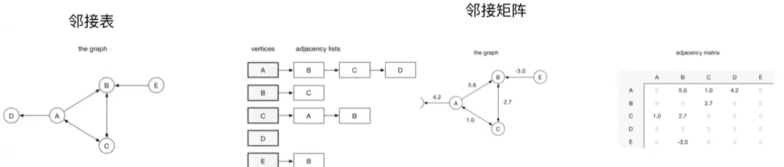
图的考察：基本的BFS、DFS、拓扑排序等。深入学习可考虑最短路径、最小生成树等。

---

### Segment Tree 线段树
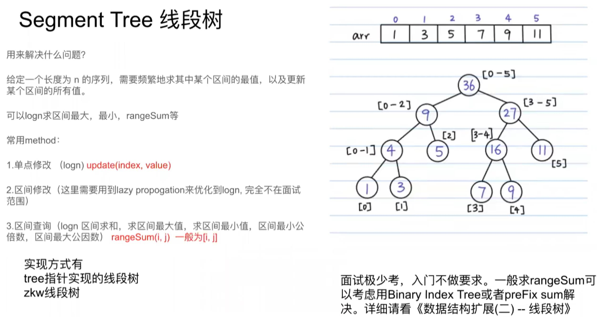

---

### Binary Index Tree(Fenwick tree) 树状数组
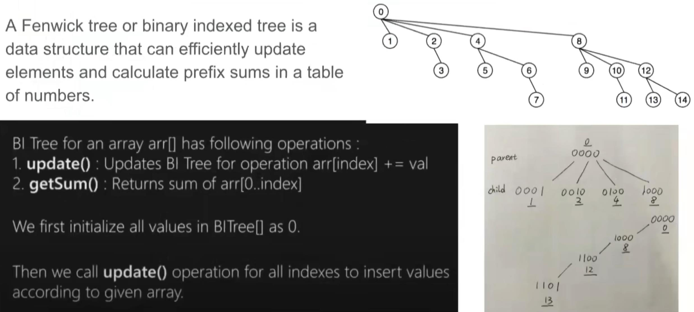

---

### Summary
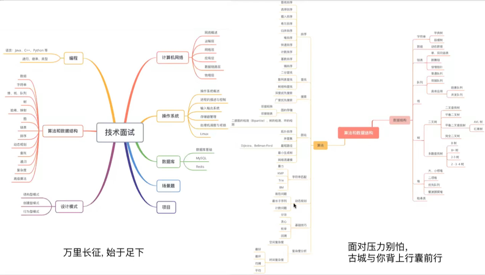

---

## 基础数据结构

### Trie

**模板：**
```
class TrieNode{
    TrieNode[] children;
    boolean isWord;
    public TrieNode(){
        children = new TrieNode[26];
    }
}
class Trie{
    TrieNode root;
    public Trie(){
        root = new TrieNode();
    }

    public void insert(String word){
        TrieNode node = root;
        for(char c : word.toCharArray()){
            if(node.children[c - 'a'] == null){
                node.children[c - 'a'] = new TrieNode();
            }
            node = node.children[c - 'a'];
        }
        node.isWord = true;
    }

    public boolean search(String word){
        TrieNode node = root;
        for(char c : word.toCharArray()){
            if(node.children[c - 'a'] == null){
                return false;
            }
            node = node.children[c - 'a'];
        }
        return node.isWord;
    }

    public boolean startsWith(String prefix){
        TrieNode node = root;
        for(char c : prefix.toCharArray()){
            if(node.children[c - 'a'] == null){
                return false;
            }
            node = node.children[c - 'a'];
        }
        return true;
    }
}
```

---

### Union Find并查集

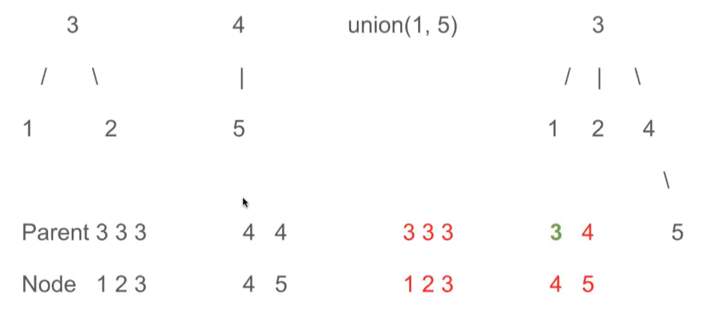

**模板：**
```
class DSU{
    int[] parent;
    public DSU(int N){
        parent = new int[N];
        for(int i = 0; i < N; i++){
            parent[i] = i; // 所有节点独立
        }
        // parent[i]代表i节点对应的的父节点（root）
    }

    // with path compression
    public int find(int x){
        if(parent[x] != x){ // 说明该节点不是父节点
            parent[x] = find(parent[x]);
        }
        return parent[x];
    }
    public void union(int x, int y){
        parent[find(x)] = find(y); // x的父节点依附到y的父节点
    }
}
```


**Improved with size(weighted)**——节点数少的树合并到节点数多的树上
    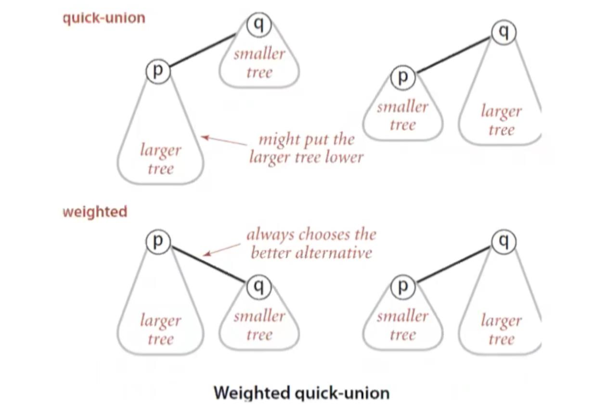

```
class DSU{
    int[] parent;
    int[] size; // 当前Node所在的group所包含的节点数

    public DSU(int N){
        parent = new int[N];
        size = new int[N];
        for(int i = 0; i < N; i++){
            parent[i] = i;
        }
        Arrays.fill(size, 1);
    }

    public int find(int x){
        if(parent[x] != x){
            parent[x] = find(parent[x]);
        }
        return parent[x];
    }

    public void union(int x, int y){
        int rootX = find(x), rootY = find(y);

        if(rootX == rootY){ // 说明两个节点在同一个group
            return;
        }

        if(size[rootX] <= size[rootY]){
            parent[rootX] = rootY; // rootY作为新的parent
            size[rootY] += size[rootX];
        }else if(size[rootX] > size[rootY]){
            parent[rootY] = rootX; // rootX作为新的parent
            size[rootX] += size[rootY]; 
        }

    }
}

```

**Improved with ranked**——高度低的树祥高度高的树合并
    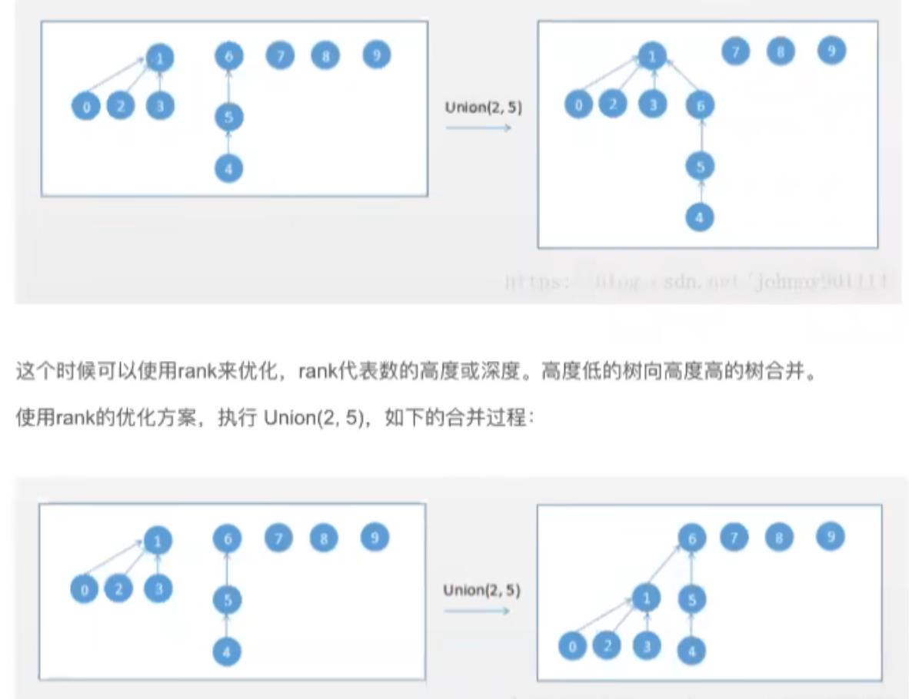

```
class DSU{
    int[] parent;
    int[] rank; // 

    public DSU(int N){
        parent = new int[N];
        rank = new int[N];
        for(int i = 0; i < N; i++){
            parent[i] = i;
        }
        Arrays.fill(rank, 1);
    }

   
    public int find(int x){
        if(parent[x] != x){
            parent[x] = find(parent[x]);
        }
        return parent[x];
    }


    public void union(int x, int y){
        int rootX = find(x), rootY = find(y);

        if(rootX == rootY){ // 说明两个节点在同一个group
            return;
        }

        if(rank[rootX] < rank[rootY]){
            parent[rootX] = rootY; // rootY作为新的parent
        }else if(rank[rootX] > rank[rootY]){
            parent[rootY] = rootX; // rootX作为新的parent
        }else{ // rank相等，需要维护rank
            parent[rootX] = rootY;
            rank[rootY]++;
        }

    }
}
```

**并查集时间复杂度**
    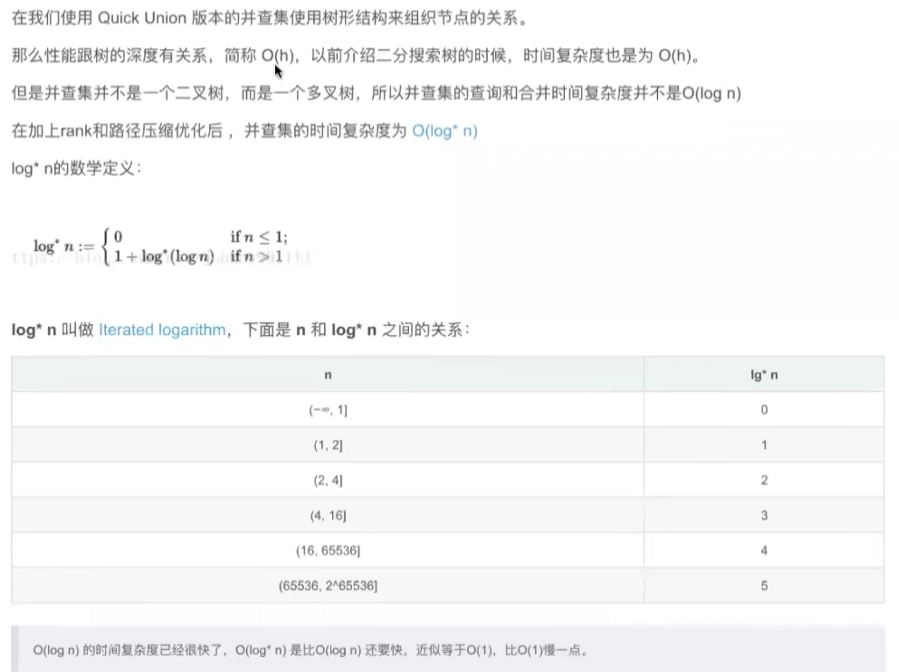

> m个Union or Find的操作，应用于n个元素上，整体的时间复杂度为 O(m log*n)

---

### Heap
(Binary) Heap是平衡二叉树的特例，root节点的值与children比较，并且根据比较结果安排位置

- Min-Heap
- Max-Heap

使用数组存储节点值（根节点存储在数组下标为0的位置，依次类推），下标为k的节点左孩子下标为`2k+1`，右孩子节点为`2k+2`；下标为k的节点其父节点下标为`(k-1)/2`

**Heapify Definition**
    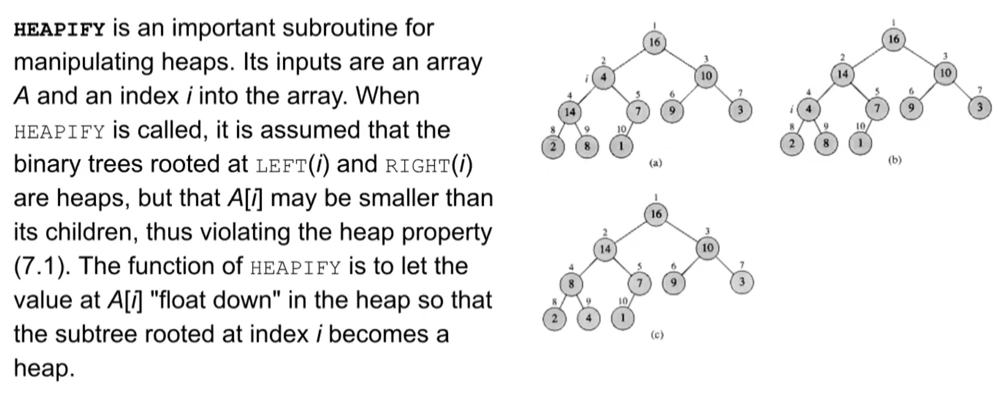
  
**PriorityQueue**

---

### 栈 队列实现

- Stack栈 Last In First Out or First In Last Out
- Queue队列 First In First Out

**Summary**
    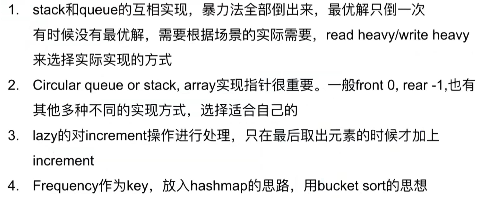

---

### 链表 反转+合并+找环

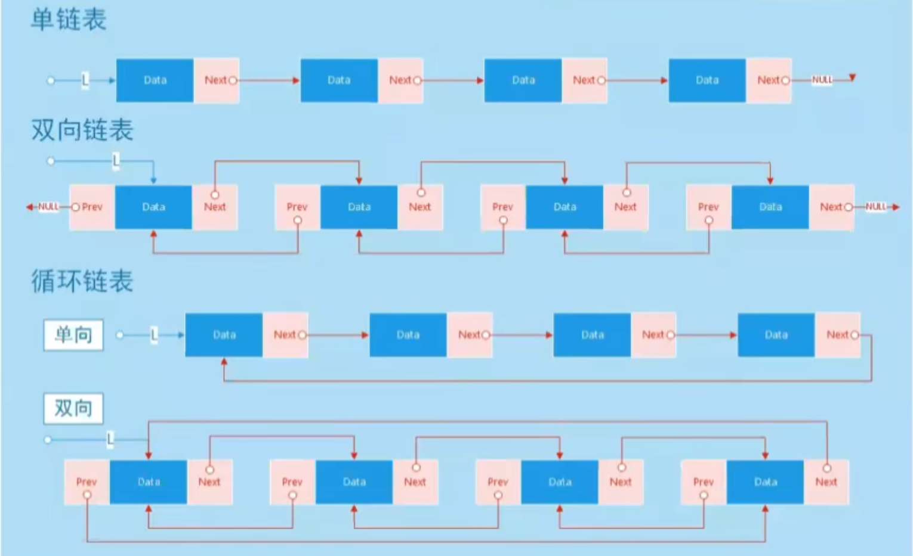

- 单链表，双链表，循环链表
- 核心操作：插入、删除、查找（遍历）

**单链表**
```
    class ListNode{
        int val;
        ListNode next;
        ListNode(int val){
            this.val = val;
        }
    }
```

**双向链表**
```
class ListNode{
    int val;
    ListNode next;
    ListNode prev;
    ListNode(int val){
        this.val = val;
    }
}
```


1. 常用reverse linkedlist的method，recursive or iterative
    ```
    public ListNode reverseLsit(ListNode head){
        ListNode newHead = null;
        ListNode cur = head;
        while(cur != null){
            ListNode next = cur.next;
            cur.next = newHead;
            newHead = cur;
            cur = next;
        }
        return newHead;
    }
    ```

2. 链表找环的基本方式
    ```
    public ListNode detectCycle(ListNode head){
        ListNode slow = head;
        ListNode fast = head;

        while(fast != null && fast.next != null){
            slow = slow.next;
            fast = fast.next.next;

            if(slow == fast){
                fast = head;
                while(slow != fast){
                    slow = slow.next;
                    fast = fast.next;
                }
                return slow;
            }
        }
        return null;
    }
    ```

> 即使是排好序的数组，用二分查找的时间复杂度也是O(logn)。正确的表述是，数组支持随机访问，根据下标随机访问的时间复杂度为O(1)

> 如果代码对内存的使用非常苛刻，就更适合用数组。因为链表中的每个节点都需要消耗额外的存储空间去存储一份指向下一个节点的指针


### 链表 删除+复制+结构转换

---

### Comparator比较器
**Comparator 和 Comparable**

Java中，对集合对象或者数组对象排序，有两种实现方式：

1. 对象实现Comparable接口
2. 定义**比较器**，实现Comparator接口。

    ```
    class Person implements Comparable<Person>{
        @Override
        public int compareTo(Person person){
            return name.compareTo(person.name);
            // return this.name - person.name;
        }
    }
    ```

    ```
    Collections.sort(people, new Comparator<Person>(){
        @Override
        public int compare(Person a, Person b){
            return a.age < b.age ? -1 : a.age == b.age ? 0 : 1;
        }
    })
    ```
    
    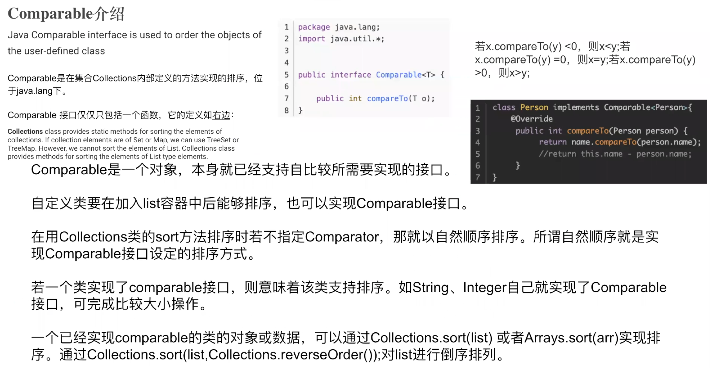

    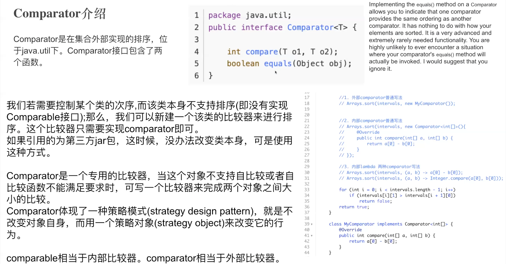

    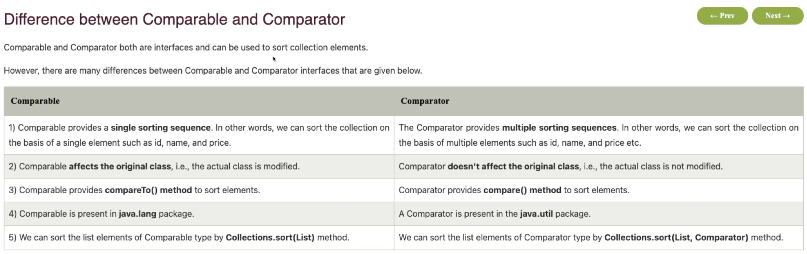

**Design Patterns - Strategy Pattern**

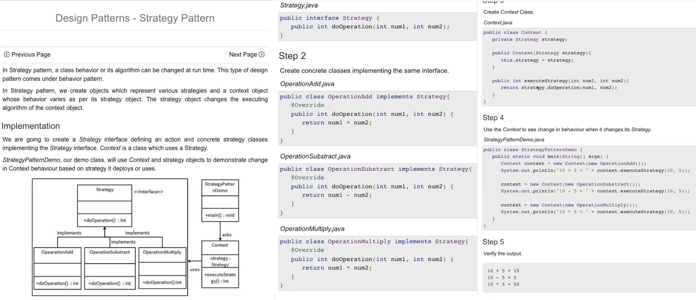

**equals() 和 hashcode()**

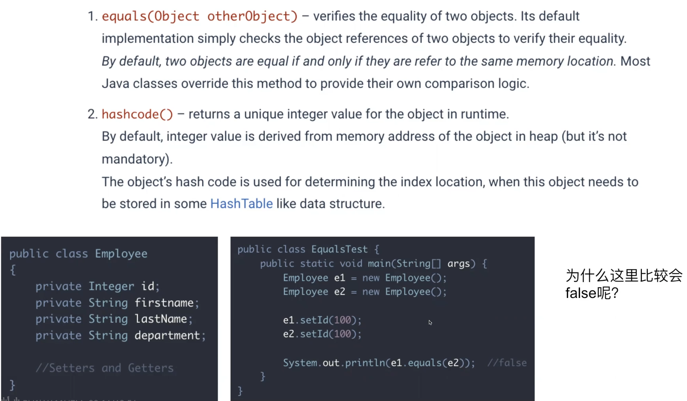
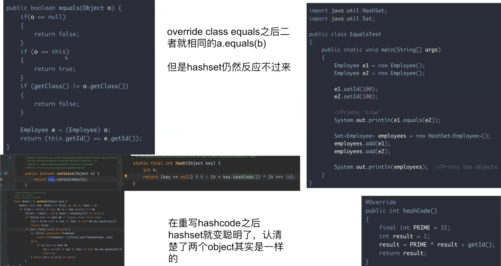

**Summary**

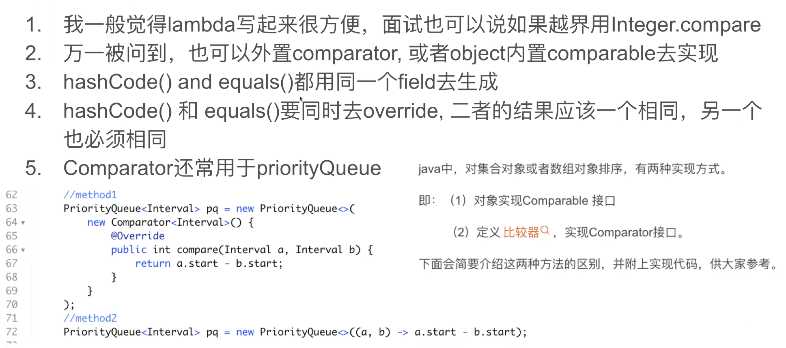

---

## 高级数据结构

---

## 基础算法

### 扫描线

> 以数飞机为例：
> 思路一：暴力扫描。遍历每个时刻，检测每个时刻有多少个飞机
> 思路二：扫描线。不需要检测每一时刻，只需要检测起点或者终点的位置（交点变化的位置只有起点或终点）

---

### BFS

---

### DFS

---

### 二分搜索

---

### 分治法

---

### 单调栈

---

### 单调队列

---

## 高级算法

---
