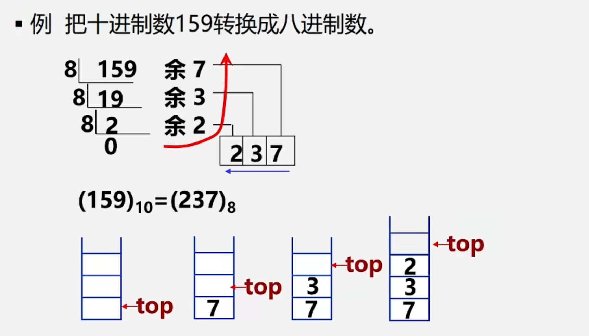
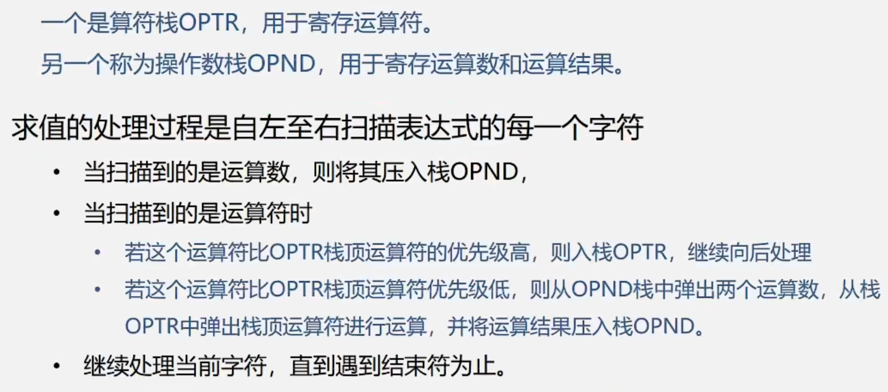
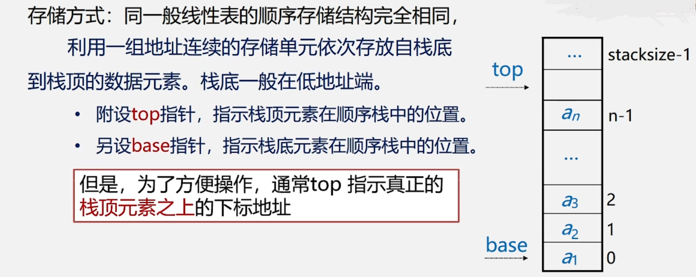
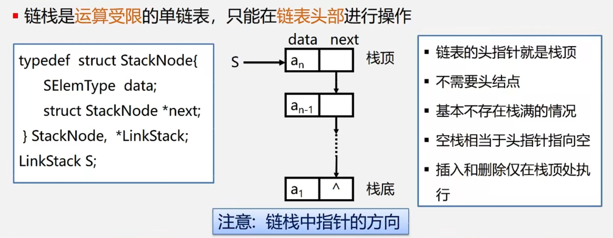

# 数据结构与算法基础
to be continued...

[数据结构与算法基础（青岛大学-王卓）](https://www.bilibili.com/video/BV1nJ411V7bd/?share_source=copy_web&vd_source=ebbd87b81a8db173b6fdf32f106f9812)

## 绪论

### 前言
程序 = 数据结构 + 算法

**基本结构：**

- 数据结构的基本概念（第1章）
  - 基本的数据结构：
    - 线性结构：
      - 线性表（第2章）
      - 栈和队列（第3章）
      - 串（第4章）
      - 数组和广义表（第4章）
    - 非线性结构：
      - 树（第5章）
      - 图（第6章）
  - 基本的数据处理技术：
    - 查找技术（第7章）
    - 排序技术（第8章）

> 勤于思考&多做练习&多上机&善于寻求帮助&不怕困难，不放弃！

### 数据结构研究
- 具体问题**抽象为数学模型**→设计算法→编程、调试、运行
- 非数值计算问题的数学模型不是数学方程，而是诸如表、树和图之类的具有**逻辑关系**的数据。
- 数据结构是一门研究非数值计算的程序设计中计算机的操作对象以及它们之间的关系和操作的学科。

### 基本概念和术语
- 数据：数值型数据、非数值型数据
- 数据元素：数据的基本单位
- 数据项：构成数据元素的不可分割的最小单位
- `数据元素`——组成数据的基本单位
    - 与数据的关系：是集合的个体
- `数据对象`——性质相同的数据元素的集合
    - 与数据的关系：集合的子集

- 数据结构：数据元素不是孤立存在的，它们之间存在某种关系，数据元素相互之间的关系称为**结构（Structure）**

- 数据结构包括：逻辑结构、物理结构/存储结构、数据的运算和实现
    - **逻辑结构**：线性结构（线性表、栈、队列、串）、非线性结构（树、图）
    - **逻辑结构**：集合、线性结构、树、图
    - **存储（物理）结构**：顺序存储结构（数组）、链式存储结构（指针）、索引存储结构、散列存储结构

- 数据类型（Data Type）= 值的集合 + 值集合的操作
- 抽象数据类型（Abstract Data Type，ADT）：逻辑结构 + 抽象运算
    ```
    ADT 抽象数据类型名{
        数据对象: <数据对象的定义>
        数据关系: <数据关系的定义>
        基本操作: <基本操作的定义>
    } ADT 抽象数据类型名
    ```
###  算法与算法分析
- **《数据结构与算法》的研究内容：**
    - 逻辑结构：研究对象的特性及其相互之间的关系
    - 存储结构：有效地组织计算机存储
    - 算法：有效地实现对象之间的“运算”关系
- 算法是解决问题的`方法和步骤`
    - 算法的描述方式：自然语言、流程图、伪代码、程序代码
- 算法的特性：有穷性、确定性、可行性、输入、输出
- 算法设计的要求：正确性、可读性、健壮性（鲁棒性）、高效性
- 算法效率：时间效率、空间效率；度量方式：事后统计、事前分析

- 算法的时间复杂度：
    - 算法运行时间 = 一个简单操作所需的时间*简单操作次数
    - 算法运行时间 = Σ每条语句的执行次数*该语句执行一次所需的时间
    - 算法所耗费的时间定义为该算法中每条语句的频度之和。
    - 便于比较不同算法的时间效率，仅比较它们的数量级
    - 算法的渐进时间复杂度：T(n) = O(f(n))
    - 最坏时间复杂度、最好时间复杂度、平均时间复杂度
    - 复杂度：O(1)<O(logn)<O(n)<O(n\*logn)<O(n\*n)<O(n\*n\*n)<O(n^k)<O(2^n)

- 算法空间复杂度：
    - 算法本身占据的空间（输入输出、指令、常数、变量等）、算法所需的辅助空间

> 实际上，无论学什么，都是要努力才可以学到真东西。只有真正掌握技术的人，才有可能去享用它。如果你中途放弃了，之前所有的努力和付出都会变得没有价值。学会游泳难吗？掌握英语口语难吗？可能是难，但在掌握了的人眼里，这根本不算什么，“就那么回事呀”。只要你相信自己一定可以学得会、学得好，既然无数人已经掌握了，你凭什么不行。

## 线性表

### 线性表的定义和特点
- 线性表：具有相同特性的数据元素的一个有限序列
- 特点：开始结点无前驱，终端结点无后继。其余结点都有前驱和后继

### 线性表的类型定义
- 抽象数据类型线性表的定义如下：
    ```
    ADT List{
        数据对象：D = {a_i | a_i 属于 Elemset, (i = 1, 2,..., n, n>=0)}
        数据关系：R = {<a_{i-1}, a_i> | a_{i-1}, a_i 属于 D, (i = 2, 3,..., n)}
        基本操作：
            InitList(&L) 初始化，构造一个空的线性表
            DestroyList(&L) 销毁线性表
            ClearList(&L) 线性表置空
            ListEmpty(L) 判断线性表是否为空
            ListLength(L) 线性表中的元素个数
            GetElem(L, i, &e) 用e返回线性表中L的第i个数据元素的值
            LocateElem(L, e, compare())返回L中第一个与e满足compare()的数据元素的位序。若这样的数据元素不存在则返回值为0
            PriorElem(L, cur_e, &pre_e) cur_e的前驱
            NextElem(L, cur_e, &next_e) cur_e的后继
            ListInsert(&L, i, e) 第i个位置插入新的数据元素e，L的长度加1
            ListDelete(&L, &e) 删除第i个数据元素，并用e返回其值，L的长度减1
            ListTraverse(&L, visited()) 依次对线性表中的每个元素调用visited()
    }
    ```

### 线性表的顺序表示和实现——顺序表
- 顺序存储定义：把逻辑上相邻的数据元素存储在物理上相邻的存储单元的存储结构。
- 顺序表：地址连续、依次存放、随机存取、类型相同→数组表示
- 由于线性表长可变，数组长度不可动态定义，所以需要用一个变量表示顺序表的长度属性
    ```
    #define LIST_INIT_SIZE 100 // 线性表存储空间的初始分配量
    typedef struct{
        ElemType elem[LIST_INIT_SIZE]; // 数组静态分配
        ElemType * data; // 数组动态分配
        int length; // 当前长度
    }SqList;
    ```
- 顺序存储结构，存、读数据时，时间复杂度为O(1)；而插入或删除时，时间复杂度为O(n)

### 线性表的链式表示和实现——链表
- 线性表的链式存储结构的特点是用一组任意的存储单元存储线性表的数据元素，这组存储单元可以是连续的，也可以是不连续的。 
- 存储（数据元素信息 + 后继元素的存储地址）：数据域 + 指针域
- 头指针、头结点和首元结点：
    - 头指针：是指向链表中第一个结点的指针
    - 首元结点：是指链表中存储第一个数据元素的结点
    - 头结点：是在链表中首元结点之前附设的一个结点
- **顺序表：随机存取**   
- **链表：顺序存取**

### 循环链表
- 单链表中终端结点的指针端由空指针改为指向头结点，使单链表形成一个环（Circular linked list）
- 循环链表可以从当中一个结点出发，访问到链表的全部结点
- 循环链表尾指针rear指向最后一个结点，此时开始节点为 `rear->next ->next`


### 双向链表

    /* 线性表的双向链表存储结构 */
    typedef struct DulNode{
        ElemType data;
        srtuct DulNode * prior; /* 直接前驱指针 */
        struct DulNode * next;  /* 直接后继指针 */
    } DulNode, *DuLinkList;

### 单链表、循环链表和双向链表的时间效率比较

|               | 查找表头结点（首元结点） | 查找表尾结点 | 查找结点*P的前驱结点 |
| ----------- | ----------- | ----------- | ----------- |
|带头结点的单链表L| L->next时间复杂度O(1) | 从L->next依次向后遍历时间复杂度O(n) | 通过p->next无法找到其前驱 |
|带头结点仅设头指针L的循环单链表| L->next时间复杂度O(1) | 从L->next依次向后遍历时间复杂度O(n) | 通过p->next无法找到其前驱 |
|带头结点仅设尾指针R的循环单链表| R->next时间复杂度O(1) | R时间复杂度O(1) | 通过p->next可以找到其前驱，时间复杂度为O(n) |
|带头结点的双向循环链表L| L->next时间复杂度O(1) | L->prior时间复杂度O(1) | 通过p->prior时间复杂度O(1) |

### 顺序表和链表的比较

- 顺序表优点：任一元素均可随机存取
- 顺序表缺点：进行插入和删除操作时，需移动大量的元素。存储空间不灵活
- 链表优点：
    - 结点空间可以**动态申请和释放**
    - 数据元素的逻辑次序靠结点的指针来指示，**插入和删除时不需要移动数据元素**
- 链表缺点：
    - 存储密度小，每个结点的指针域需额外占用存储空间。当每个结点的数据域所占字节不多时，指针域所占存储空间的比重显得很大
    - 链式结构是非随机存取结构。对任一结点的操作都要从头指针依指针链查找到该结点，这增加了算法的复杂度

## 栈和队列
栈和队列是限定插入和删除只能在表的“端点”进行的线性表

### 栈的定义和特点
- 定义：限定只能在表的一端进行插入和删除运算的线性表（只能在栈顶操作）
- 逻辑结构：与线性表相同，仍为一对一关系
- 存储结构：用顺序栈或链栈存储均可，但以顺序栈更常见
- 运算规则：只能在栈顶运算，且访问结点时依照后进先出（LIFO）原则
- n个不同的元素进栈，出栈序列的个数为卡特兰数 $C_{2n}^{n}/(n+1)$

### 队列的定义和特点
- 定义：限定只能在表的一端进行插入运算，在表的另一端进行删除运算的线性表（头删尾插）
- 逻辑结构：与线性表相同，仍为一对一关系
- 存储结构：用顺序队或链队存储均可，以循环顺序队列更常见
- 运算规则：只能在队首和队尾运算，且访问结点时依照先进先出（FIFO）原则

### 栈和队列的应用

- **进制转换（栈）**
    
- **括号匹配（栈）**
- **表达式求值（栈）**
    
- **舞伴问题（队列）**

## 栈的表示和实现

- 栈的抽象数据类型的类型定义：
    ```
    ADT Stack{
        数据对象：D = {a_i | a_i 属于 Elemset, (i = 1, 2,..., n, n>=0)}
        数据关系：R1 = {<a_{i-1}, a_i> | a_{i-1}, a_i 属于 D, (i = 2, 3,..., n)}
        约定a_n端为栈顶，a1端为栈底
        基本操作：初始化、进栈、出栈、取栈顶元素等
    }
    ```

- **顺序栈**
    

- **链栈**
    

## 树

## 图

## 查找

## 排序