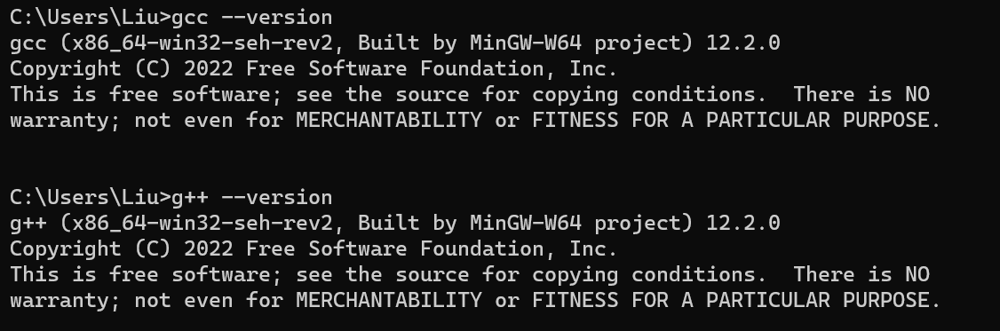
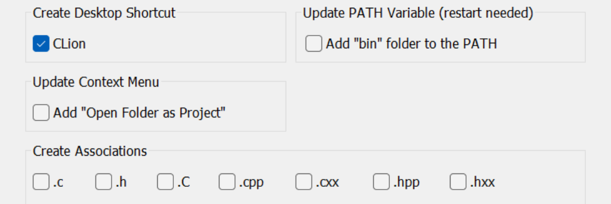
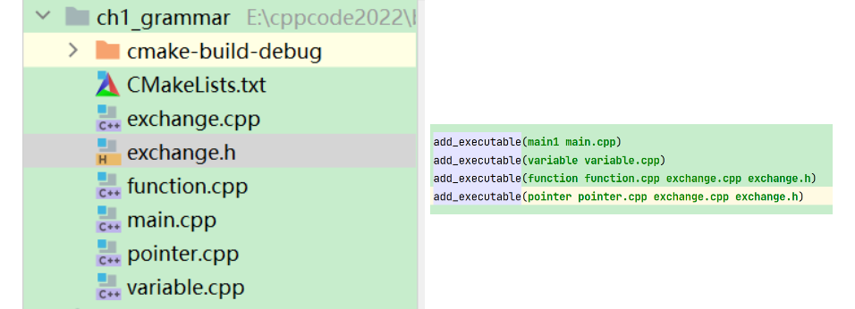

# CLion

## mingw64下载安装
- 下载地址：<https://sourceforge.net/projects/mingw-w64>
- Github地址：<https://github.com/niXman/mingw-builds-binaries/releases>
- 解压之后在系统环境变量 Path 中添加 `<解压目录>/bin`
- 通过 `gcc --version` 和 `g++ --version` 命令查看是否安装成功

## CLion安装及创建项目
- 下载地址：<https://www.jetbrains.com/clion>
- 自定义安装路径，并选择创建桌面快捷方式

Update PATH Variable是指可以通过命令行打开CLion；
Add "Open Folder as Project" 右键文件夹可以打开项目；
Create Associations 设置为一些文件的默认打开方式

### 创建新项目
`New->New Project->C++ Executable`

### CLion中函数的分文件编写
1. 创建后缀名为`.h`的头文件
2. 创建后缀名为`.cpp`的源文件（文件名与头文件一致，后缀不一致）
3. 在头文件中写函数的声明
4. 在源文件中写函数的定义
> CLion中实现分文件编写，首先同时添加 `.h` 和 `.cpp` 文件，`.h`文件中声明函数，`.cpp`文件中定义函数，主文件中添加 `#include"xx.h"` 同时要在`CMakeLists.txt`文件中 `add_executable(主文件名 主文件名.cpp 函数文件.cpp 函数文件.h)`

### 一个项目中多个main函数
- 在CLion中一个项目里的可以有多个main函数，例如，下图中每个.cpp文件中都有自己的main函数

1. 首先创建 .cpp文件，在 CMakeLists.txt 文件中添加 `add_executable(文件名 文件名.cpp)`
2. 如果一个项目中有子文件夹可以在子文件夹中，先在主项目的 CMakeLists.txt 文件中添加 `add_subdirectory(子文件夹)` ，然后在子文件夹中创建 CMakeLists.txt 文件，通过`add_executable()` 进行对应的文件编译
3. 右侧第三行是在 function.cpp 中引用了 exchange.cpp 中的函数
4. 第四行是在 pointer.cpp 主函数文件中引用了exchange.cpp中的函数

### 通过Git管理以及连接GitHub

#### 方式一
- 创建项目以及通过Git进行版本控制

1. CLion中创建新项目
2. VCS$\rightarrow$Create Git Repository
3. 右键cmake-build-debug$\rightarrow$Git$\rightarrow$Add to .gitignore
4. 同理，将不需要进行版本控制or上传到GitHub的文件添加到.gitignore文件中

- 将项目文件上传到GitHub
  
1. 在GitHub中创建Repo
2. CLion中Git$\rightarrow$Manage Remotes$\rightarrow$
3. 选择+，name: origin, url: GitHub中Repo的SSH链接
4. 在主文件夹下的CMakeLists.txt文件中添加子文件夹`add_subdirectory(dirname)`
5. 在`dirname`文件夹中创建CMakeLists.txt文件，通过`add_executable(filename filename.cpp)`添加可执行.cpp文件
6. Git$\rightarrow$Add$\rightarrow$Commit$\rightarrow$Push

> 注意：这种方式Push的时候要选择origin->main

#### 方式二
1. 先在GitHub中创建Repo
2. CLion中直接从GitHub中导入项目
3. 创建CMakeList.txt，点击Load CMake Project，之后会自动创建cmake-build-debug文件夹，将该文件夹加入到gitignore文件
4. 新建文件并编写代码
5. 配置CMakeLists.txt
6. Git$\rightarrow$Add$\rightarrow$Commit$\rightarrow$Push
