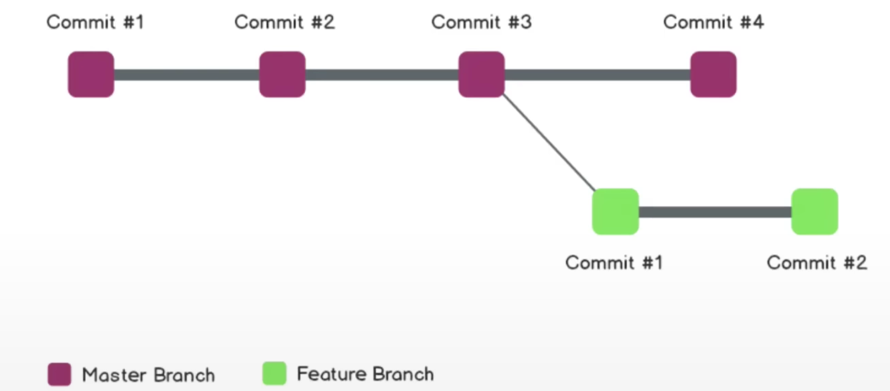

# Git

> Git 和 GitHub 入门， 强烈推荐<https://youtu.be/RGOj5yH7evk> 教程！

## Git的安装
1. Git官网直接[下载安装包](https://git-scm.com/downloads)
2. 修改安装路径到合适的目录下，其余按照默认选项安装即可
3. 开始菜单中，找到 Git Bash 打开 or 桌面右键选择 Git Bash，输入 `git -v` 即可查看安装的 Git 版本

## Git and GitHub for Beginners——Crash Course
### Git是什么？

- 免费的开源的版本控制系统（Version Control System）
- 版本控制是什么？The management of changes to documents, computer programs, large web sites, and other collections of information.

### 一些术语：
- `Directory` → Folder
- `Terminal or Command Line` → Interface for Text Commands
- `CLI` → Command Line Interface
- `cd` → Change Directory
- `Code Editor` → Word Processor for Writing Code
- `Repository` → Project, or the folder/place where your project is kept
- `Github` → A website to host your repositories online

### Git Commands：
- `clone` → Bring a repository that is hosted somewhere like GitHub into a folder on your local machine 从GitHub或其他网站上下载项目到本地
- `add` → Track your files and changes in Git 告诉Git项目中的变化
- `commit` → Save your files in Git 保存文件的变化
- `push` → Upload Git commits to a remote repo, like GitHub 上传commit到远端仓库
- `pull` → Download changes from remote repo to your local machine, the opposite of push 从远端下载仓库的变化到本地

### Git Branching：
- Feature Branch最开始和Master Branch 是一样的，当在F B中改变文件，M B并不会知道，修改完成后在合并到M B中，更适用于多人协作。
- `git checkout -b feature` 新建feature分支 并在该分支上做文件修改
- `git checkout master` 切换到master分支，master分支上看不到所做的修改
- `git branch` 查看分支
- 在master分支下，使用 `git merge feature` 命令，将feature分支所做的修改合并到master上
- 在GitHub中 `merge pull request`
- `git branch -d feature` 删除feature分支

