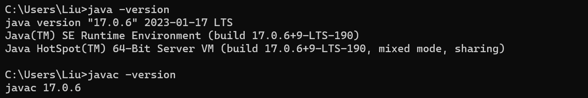

# IntelliJ IDEA

JDK-JRE-JVM

JDK、JRE 和 JVM 是 Java 开发和运行环境中的三个重要概念。

JDK（Java Development Kit）是 Java 开发工具包，它是开发 Java 应用程序所必需的软件环境。JDK 包含了 JRE、Java 开发工具（例如编译器和调试器）、Java 类库和其他支持文件。如果需要进行 Java 应用程序的开发工作，就需要安装 JDK。

JRE（Java Runtime Environment）是 Java 运行环境，它是运行 Java 应用程序所必需的软件环境。JRE 包含了 Java 虚拟机（JVM）、Java 类库和其他支持文件。如果只是需要运行 Java 应用程序，而不需要进行 Java 开发工作，那么安装 JRE 就足够了。

JVM（Java Virtual Machine）是 Java 虚拟机，它是 Java 运行环境的核心组件之一。JVM 可以将 Java 代码编译成字节码，然后在各种计算机平台上运行。JVM 负责解释字节码并将其转换成本地机器指令，以便计算机可以执行 Java 应用程序。

因此，JDK 包含了 JRE 和开发工具，JRE 包含了 JVM，JVM 是 Java 运行环境的核心，它为 Java 应用程序提供了跨平台的能力。

## JDK下载及环境变量配置
1. **<https://www.oracle.com/cn/java/technologies/downloads/> 官网下载并安装JDK**
2. **配置环境变量**
    
    JDK17安装时会自动配置环境变量（例如在系统变量Path中添加 `C:\Program Files\Common Files\Oracle\Java\javapath`），但是建议手动配置。
    
    设置$\rightarrow$系统$\rightarrow$系统信息$\rightarrow$高级系统设置$\rightarrow$环境变量$\rightarrow$系统变量
    - 新建：变量名 JAVA_HOME，变量值为 JDK 安装目录
    - 选中 Path 变量，添加配置：`%JAVA_HOME%\bin`
3. **测试JDK是否安装成功**
   
   `win+R`输入 `cmd` 打开命令行窗口，输入 `java -version` 或者  `javac -version`
    

## IDEA安装及配置

1. 安装包下载地址：<https://www.jetbrains.com/zh-cn/idea/>
2. 有**社区版**（Community Edition-开源，免费）和**旗舰版**（Ultimate Edition，免费试用30天）两种可选。
   
   > 在校学生可以通过校园邮箱注册 JetBrains 账号，免费激活使用 IDEA、CLion、Pycharm、GoLand 等。
3. 下载好之后双击，更改安装路径（一般不安装在 C 盘，且路径最好不要包含中文）

## IDEA中创建新项目

> IntelliJ IDEA 2023.1 (Ultimate Edition) 中自带的IDEA使用教程：`Learn IDE Features for Java`

### 新建项目
1. File$\rightarrow$New$\rightarrow$Project（New Project/Empty Project）
   - Name 中填入项目名称
   - Location 处选择合适的项目保存地址
   - 一般 IDEA 会自动检测到系统中安装的 JDK，故无需再进行选择
2. 新建包or模块，即可开始写代码！
3. 具体的IDEA操作可以看官方文档：<https://www.jetbrains.com.cn/help/idea/getting-started.html>

## IDEA项目配置Git并关联到GitHub
**官方文档：**
- 版本控制系统：<https://www.jetbrains.com.cn/help/idea/version-control-integration.html>
- Git：<https://www.jetbrains.com.cn/help/idea/using-git-integration.html>

> 如果想要通过Git管理项目，IDEA首先会自动检测电脑中是否安装了Git

### 通过Git进行管理
- 新建项目 并且创建Git repo(本地库-可以在目录中看到.git文件夹)
  - 方式一：可以在创建项目时同时创建 repo
  - 方式二：通过 `VCS -> Import into Version Control -> Create Git Repository`
- `Add`操作（在模块或者文件上右键 `Git->Add` ）—— 快捷键 `Ctrl+Alt+A`
- `Commit`操作（右键 `Git->Commit`）
  
### IDEA中项目关联到GitHub
- 首先在GitHub创建一个空的项目
- 在IDEA中创建新项目，并为该项目创建Git仓库（创建仓库之后所有的文件都会变红，代表还没通过 `Add` 操作添加到暂存区）
- 左上角选择 `Git->Manage Remote`，然后添加远程（URL为GitHub上项目的地址）
- 新建文件`Add->Commit->Push`

### 新建分支
项目开发中一般需要新建分支,在自己的分支上进行代码编写和修改
发生冲突时的两种解决方法：
- rebase
- merge

### Pull Request
to be continued......